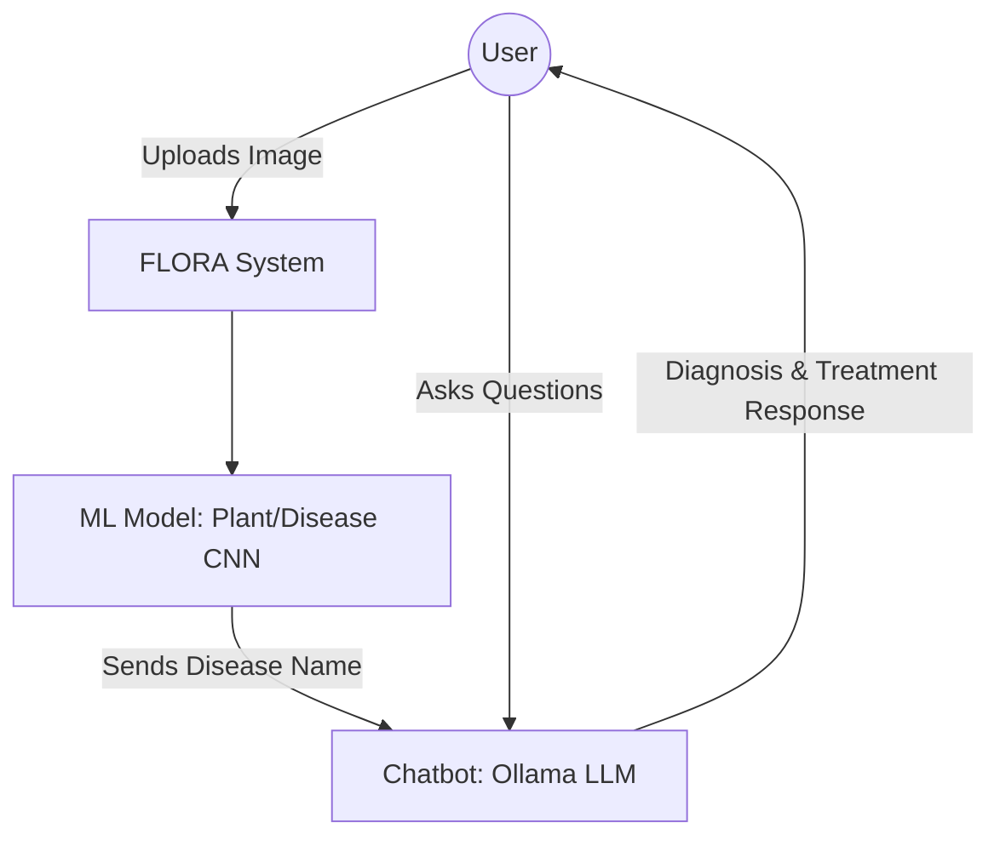
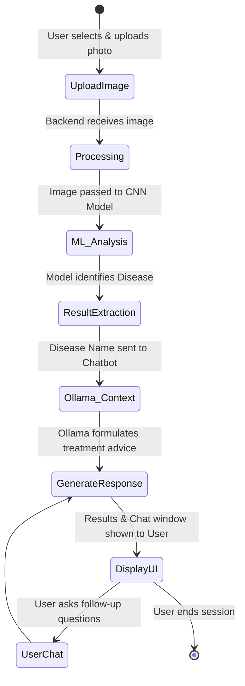
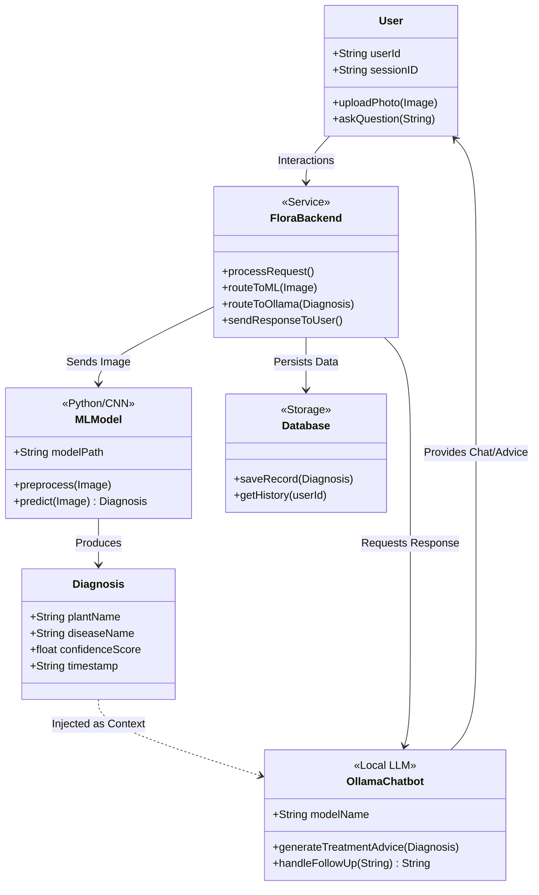

# FLORA: Intelligent Plant Recognition & Disease Diagnosis System

## Project Overview
FLORA is an AI-powered system designed to assist users in identifying plants, detecting diseases, and receiving treatment recommendations. The system integrates Computer Vision models with a Natural Language Processing chatbot powered by Ollama, all connected through a Node.js backend.

---

## Features
* **Plant recognition** using image input.
* **Disease detection** and diagnosis.
* **AI chatbot** using Ollama for interactive support.
* **Treatment suggestions** and detailed guidance.
* **Web-based interface** for easy accessibility.
* **Fast and scalable** Node.js backend.

---

## Tech Stack
* **AI Models:** Python, TensorFlow / PyTorch (CNN).
* **Chatbot:** Ollama (Local LLM).
* **Backend:** Node.js (Express).
* **Frontend:** HTML, CSS, JavaScript.
* **Dataset:** PlantVillage.

---

## System Workflow
1. **Image Upload:** The user uploads a photo of a plant via the web interface.
2. **Analysis:** The Node.js backend sends the image to the CNN-based Machine Learning model.
3. **Identification:** The ML model identifies the plant and detects the specific disease.
4. **Context Handoff:** The model sends the identified disease name to the **Ollama chatbot**.
5. **Interactive Support:** Ollama processes the diagnosis and initiates a conversation with the user, providing treatment advice and answering follow-up questions.

---

## 📊 Use Case Diagram

---

## 📈 Activity Diagram

---

## 🏗️ Class Diagram

---

## 👥 Team
* **Ahmed Waleed** – Machine Learning
* **Mohamed Sayed** – Data Science
* **Shehab Eissa** – Frontend Development
* **Seif Eldeen Hamouda** – Chatbot (NLP)
* **Seif Osama** – Chatbot (NLP)
* **Youssef Mahdy** – Backend Development (Node.js)

---

## ⚠️ Important Notes
* This project utilizes **Ollama** instead of Rasa for the chatbot implementation.
* The backend is built using **Node.js (Express)** to ensure high performance and scalability, replacing the initial Django proposal.
